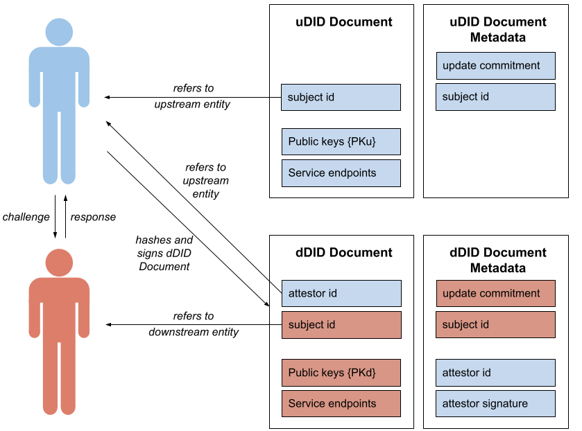

# Trustchain

Trustchain is a decentralised approach to public key infrastructure, with applications in digital identities. In particular, it builds on the W3C standards for [decentralised identifiers (DID)](https://www.w3.org/TR/did-core/) and [verififiable credentials (VC)](https://www.w3.org/TR/did-core/).

These two standards are already closely linked: Verifying a VC involves performing the verification method specified in the DID document using verification material contained in the same DID document. For example, the verification material may be a public key, in which case the verification method is to use the key to verify a digital signature contained in the VC.

Trustchain enables the creation of DIDs which are themselves verifiable. Via this mechanism, chains of trustworthy DIDs can be constructed in which **downstream DIDs** (dDIDs) contain an attestation from an entity represented by an **upstream DID** (uDID).

The following links may be of particular interest:
- [Trustchain repo](https://github.com/alan-turing-institute/trustchain)
- [Trustchain wiki](https://github.com/alan-turing-institute/trustchain/wiki)
- [Trustchain FAQ](https://github.com/alan-turing-institute/trustchain/wiki/Trustchain-FAQ)
- [Slides & Videos](https://github.com/alan-turing-institute/trustchain/wiki#communication)
- [Technical Notes](https://github.com/alan-turing-institute/trustchain/wiki/Trustchain-Technical-Notes)
