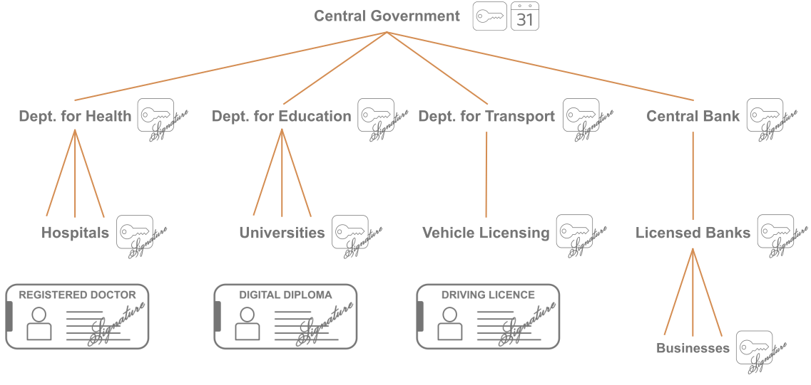
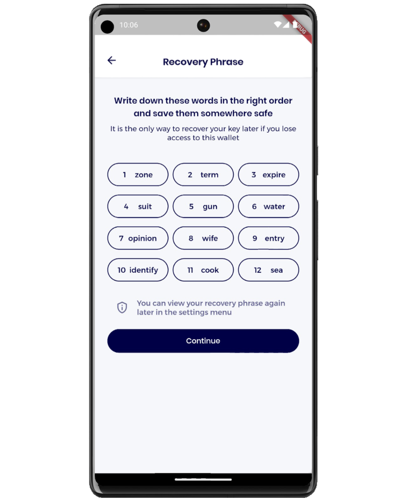
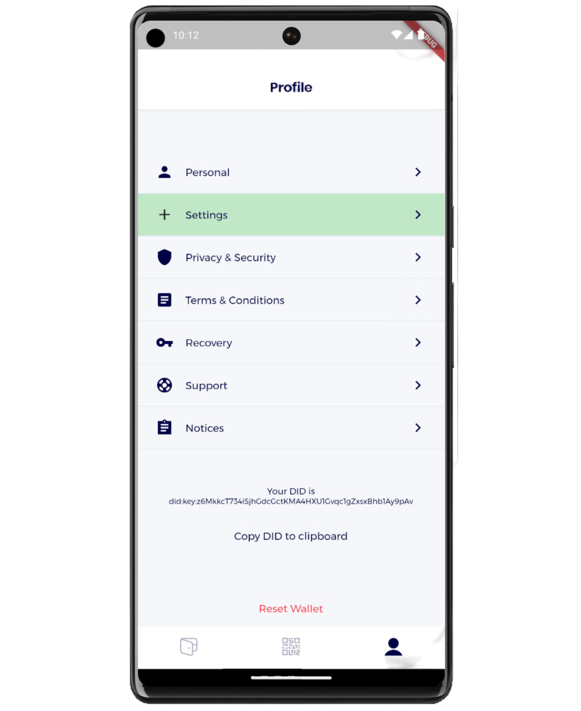
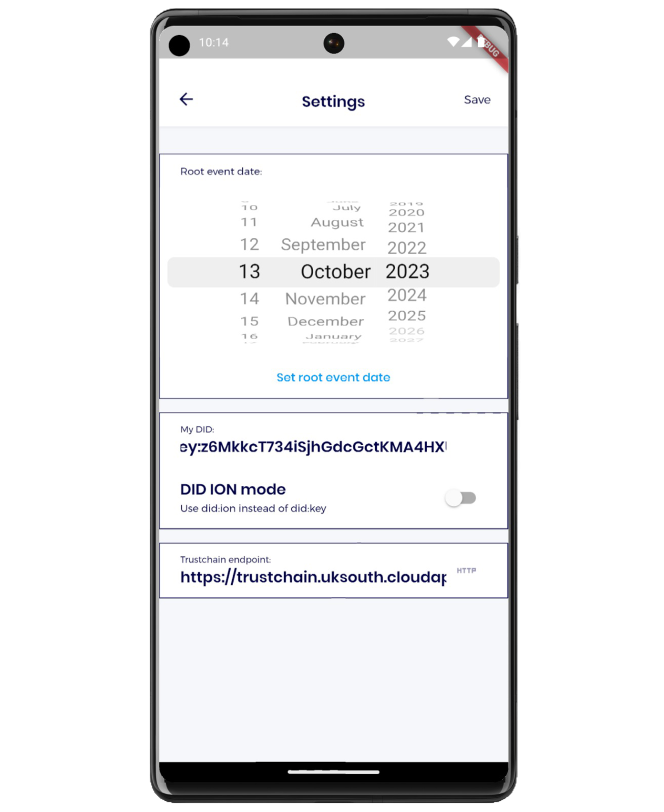
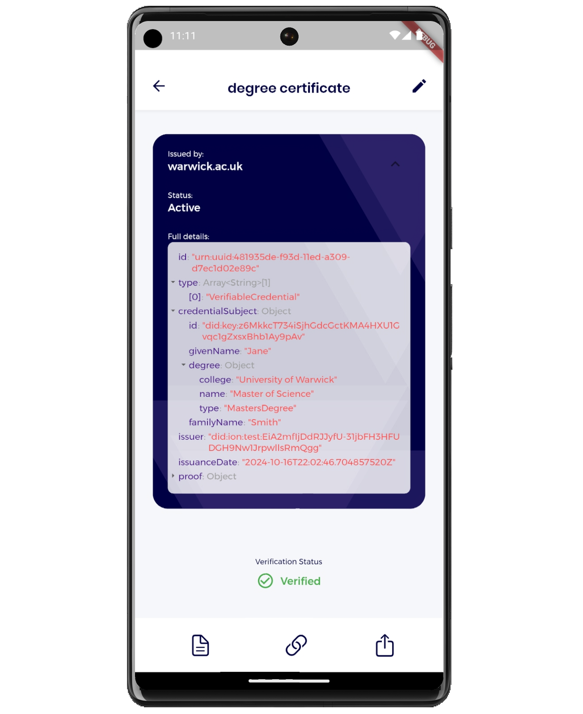
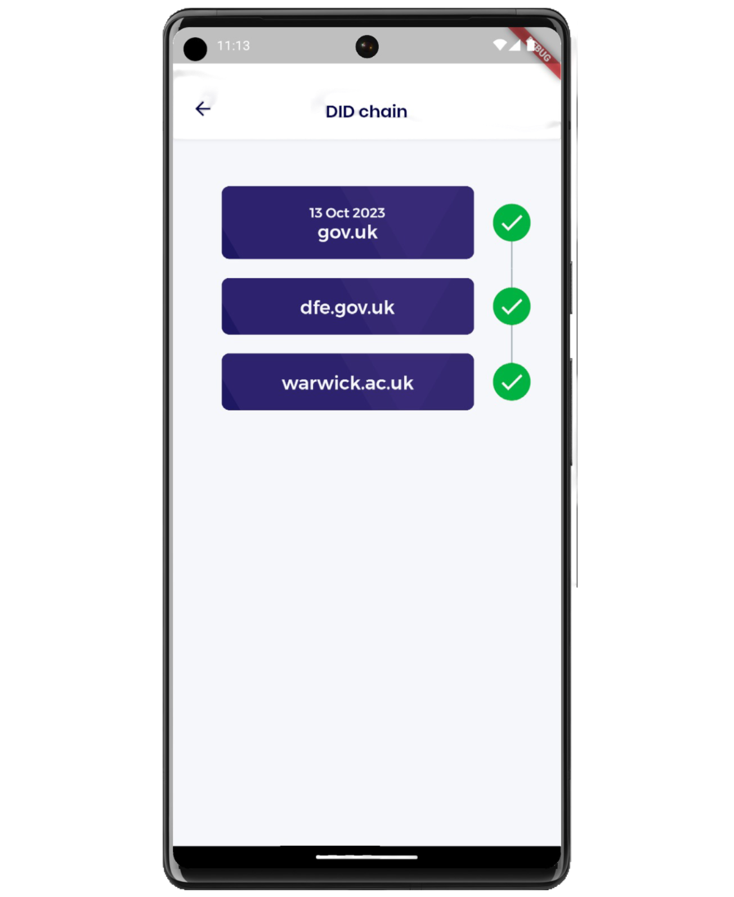
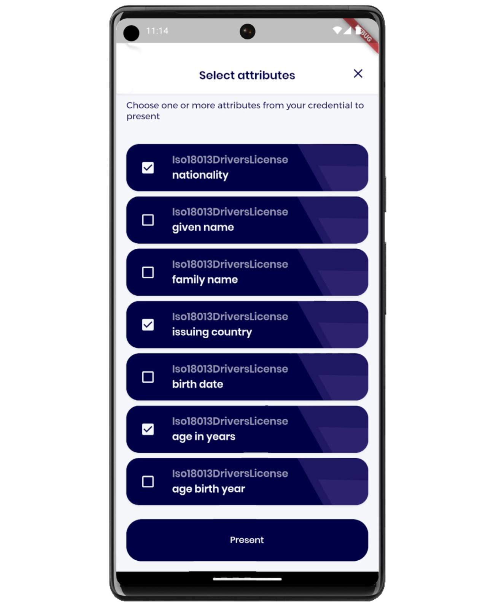
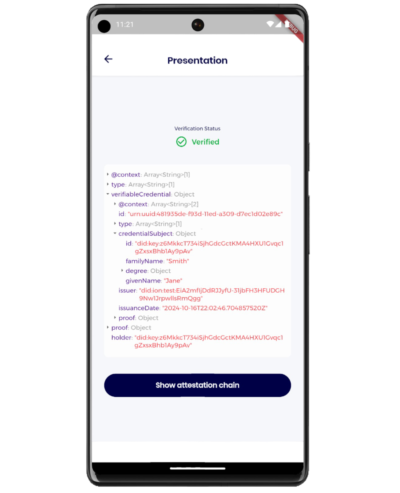

# Demonstration

This page outlines a demonstration of the Verifiable Credentials use case. To run the demonstration, checkout branch `demos/aiuk24` on both the [Trustchain](https://github.com/alan-turing-institute/trustchain/) and [Trustchain Mobile](https://github.com/alan-turing-institute/trustchain-mobile) repositories.

## Scenario

For this demonstration, we assume a scenario in which Trustchain is deployed at a national scale, to support a trustworthy and privacy-preserving digital identity system. The corresponding network of decentralised identifiers (DIDs) is depicted in the following figure.

In this scenario, the central government is the natural choice for the legal entity represented in the root DID. We stress, however, that this choice is merely an example intended to make for an easily relatable demonstration. In practice any organisation, public or private, may play this role.

Each legal entity is represented digitally by its DID, which is depicted by a key icon because the essential content of the corresponding DID document is a set of cryptographic public keys (although URL endpoints are also included).

With the exception of the root DID, each DID is signed by the immediate upstream entity, creating chains of verifiable public key certificates (downstream DIDs).

The root DID itself carries no signature, because there is no upstream entity to provide such an attestation. Instead, the trustworthiness of the root DID is guaranteed by its [independently-verifiable timestamp](faq.md#q-what-is-meant-by-the-term-independently-verifiable-timestamping). This is depicted in the figure by a calendar icon.

&nbsp;

<figure markdown="span">
{ width="1600" }
<figcaption>Figure: Trustchain DID network in a national digital ID scenario</figcaption>
</figure>

## Storyboard

Each participant is assumed to have access to a mobile device with the Trustchain Mobile credential wallet app installed. The demonstration takes the user through the process of onboarding, configuring the app, receiving and verifying one or more digital credentials, and finally generating a verifiable presention (as a displayed QR code) which can be read and verified by another participant using the same mobile app.

Trustchain Mobile is a fork of the Credible credential wallet app developed by [SpruceID](https://www.spruceid.dev/).

### Onboarding

{ align="right"; width="360" } 

&nbsp;

When the Trustchain Mobile app is run for the first time, the user is presented with the onboarding process.

&nbsp;

The first step in this process is to generate a *recovery phrase*: twelve randomly selected words from a fixed vocabulary. The user is instructed to write down these words and keep them in a safe and secure place, so they will be able to recover their personal DID if they lose access to the wallet on this device.

&nbsp;

After hitting continue, they are asked to enter three of the twelve words to confirm the recovery phrase has been correctly recorded. 

&nbsp;

### Profile

{ align="right"; width="360" } 

&nbsp;

Having completed the onboarding stage, the user is taken to the Profile page.

&nbsp;

Their newly-generated personal DID is displayed near the bottom of this screen.
This was constructed from a new public-private key pair, generated by the app using the recovery phrase as a random seed. The user's personal DID encodes their public key via the [`did:key`](https://github.com/w3c-ccg/did-method-key) method.
The user's private key was also stored securely on the device, to be used later for signing verifiable presentations.

&nbsp;

Near the top of the profile page, the user is directed by a green panel to enter the Settings page.

&nbsp;

### Configuration

{ align="right"; width="360" } 

Before using the app, one essential configuration step is necessary.
The user must enter the root event date. That is, the date on which the root DID was published.

&nbsp;

This date is assumed to have been communicated to the user out-of-band by the legal entity represented in the root DID. Since the date on which Trustchain DIDs are published can be [independently verified](http://127.0.0.1:8000/faq/#q-why-is-independently-verifiable-timestamping-important-in-trustchain) by all users, the timestamp on the root DID is the essential mechanism through which the user can be certain they have identified the legitmate root DID published by the genuine root entity, and not an imposter.

&nbsp;

A short 3-character confirmation code must also be entered at the same time as the root event date. This code identifies the specific Bitcoin transaction used to anchor the root DID.

### Credential Wallet

{ align="right"; width="360" } 

With the root DID configuration in place, the app is able to verify the signature of any legal entity whose DID is part of the user's network.
It can therefore verify the authenticity of any downstream DID in the network and any credential issued by those entities.

&nbsp;

The user then scans a QR code that encodes a downstream DID, together with a path fragment that identifies a particular URL endpoint inside the DID document.
This is the URL of an API endpoint for credential issuance.

&nbsp;

The app resolves the downstream DID in the QR code and verifies it by checking the chain of attestation signatures up to the root DID, and then verifying the root DID timestamp.
If successful, the user can be certain of the identity of the issuing authority. 
They can then receive a verifiable credential, e.g. a digital university diploma as in this example.

### DID Chain

{ align="right"; width="360" } 

All credentials received by the app are automatically checked for authenticity.

This involves verifying not only the signature of the issuing authority (and the credential expiry date), but also the attestation signatures on the chain of downstream DIDs and the timestamp on the root DID. 
The root DID timestamp is compared to the configured root event date (and the confirmation code). Only if all of these checks pass is the credential deemed valid.

For maximum transparency, the user is also able to view the chain of downstream DIDs leading from the credential user back to the root entity. Each of the legal entities represented in this chain ought to be recognisable to the user, who can judge for themselves the level of trust they are willing to place in them, and the extent to which they are the appropriate entities to be involved in the issuance of the particular credential type.

### Verifiable Presentation

{ align="right"; width="360" } 

In the final step of the demonstration, the user generates a presentation from their credential, which can be verified using another device running the same Trustchain Mobile app.

Typically a credential will contain multiple personal attributes relating to the holder, such as their name, nationality, date of birth, etc.

Depending on the context, the user may wish to share only a subset of these attributes when presenting the credential. This is a key privacy benefit of digital ID systems (based on verifiable credentials) over traditional physical credentials which disclose all attributes to the verifier.

Trustchain supports a redactable signature scheme which enables the user to selectively disclose only those attributes that they are willing to share.

&nbsp;

### Device-to-Device Verification

{ align="right"; width="360" } 

When the user has selected the attributes for sharing, the app generates a presentation in which all other attributes are redacted, but which still contains a valid signature from the credential issuer. The presentation is also timestamped and signed using holder's private key, to prevent stale presentations from being re-used.

The app then encodes this presentation in a QR code which is displayed on the device.

Any other device running Trustchain Mobile can then scan this QR code and verify the authenticity of the credential from which it was generated.

Naturally, the verifier's app must be configured with the same root event date as the credential holder's. This common knowledge of the root event date across all users of the network of trusted DIDs is a fundamental assumption on which Trustchain relies. 

&nbsp;
