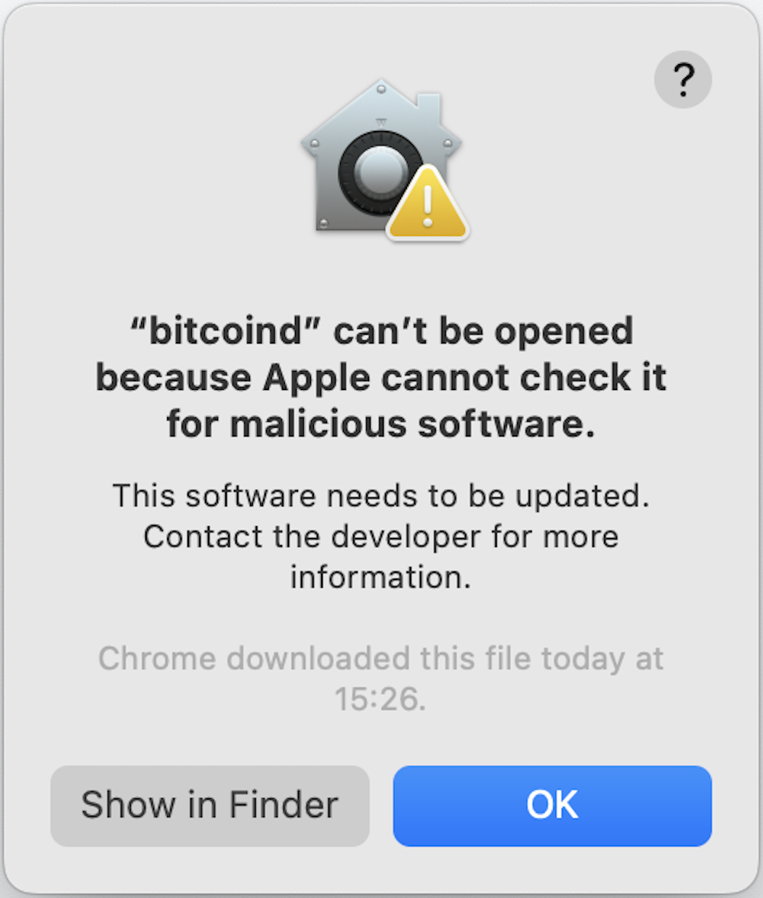
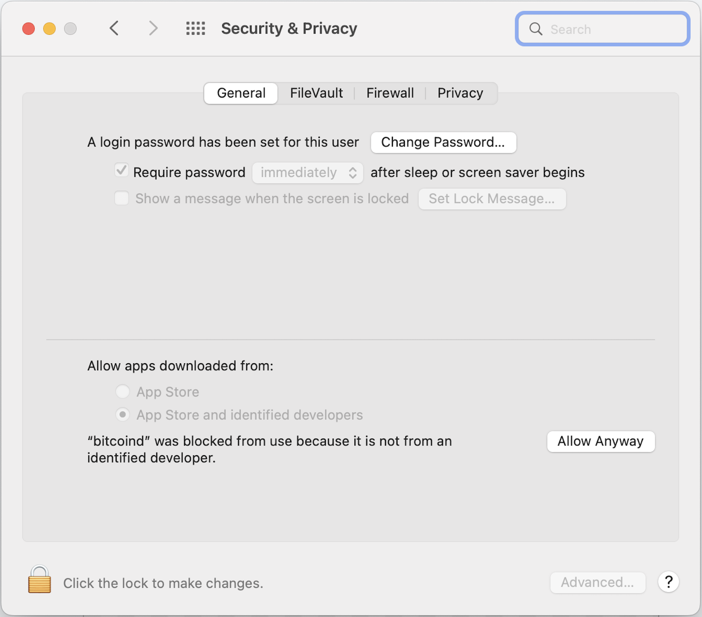

# ION

The [Identity Overlay Network](https://identity.foundation/ion/) (ION) is an open source [DID method](https://www.w3.org/TR/did-core/#methods) implementation developed by the Decentralized Identity Foundation.

In other words, ION is a software tool that can be used to perform DID operations, such as creating and publishing new DIDs and DID documents, and resolving existing ones. It does this by reading and writing data to the [Bitcoin](https://bitcoin.org/en/) blockchain and to the [IPFS](https://ipfs.tech/) distributed file system. As such, every ION instance is a node on these two peer-to-peer networks.

Trustchain delegates the execution of DID operations to an ION node. Therefore to use Trustchain you must first install and run ION, either on the same machine or a connected one.

!!! warning "ION resource requirements"

    An ION installation includes a full node on the Bitcoin network, which must download and store the entire Bitcoin blockchain. This is a large amount of data that typically takes several hours, or even days, to download.

    The recommended system requirements for an ION installation are:

    - 6GB of RAM
    - 1TB of storage.

Note, however, that **Trustchain makes no assumptions about the trustworthiness of the ION system** and the Trustchain security model does not rely on the correct functioning of the ION software. Trustchain independently verifies all of the data it receives from ION, so a faulty or compromised ION node would not represent a security vulnerability in Trustchain (although it could cause a loss of service).

This page explains how to install and run ION.

<!-- TODO: insert the architecture schematic diagram here? (from the paper). -->

## Preliminaries

Before beginning the installation, a few decisions must be made that will determine exactly what steps should be taken.

### Docker Container vs. Full Installation

The simplest way to run ION is using Docker, and it can be a useful way to experiment with the system before performing a full installation. However, this method provides a **read-only ION node**. This means that it provides access to existing DIDs, but cannot be used to create and publish new ones.

If you would like to be able to use Trustchain to create and publish your own DIDs, follow the full installation instructions below (and ignore the [ION with Docker](#ion-with-docker) section).

If you want to run ION using Docker, you can skip most of this page and just follow the instructions in the [ION with Docker](#ion-with-docker) section.

### Mainnet vs. Testnet

The Bitcoin client wrapped inside an ION node can be configured either for **Mainnet** (the main Bitcoin network) or **Testnet** (an alternative blockchain designed for testing and software development).

Mainnet should be used for a production deployment of Trustchain because DID operations published on the Bitcoin blockchain have extremely strong immutability, persistence and discoverability properties. When testing Trustchain, however, it is sensible to configure the ION Bitcoin client for Testnet, since coins on the test network have no monetary value and therefore "test" DID operations can be executed at zero cost.

Testnet coins can be requested from a Testnet "faucet", such as [this one](https://coinfaucet.eu/en/btc-testnet/).

In this guide, commands and configuration settings may depend on which network is in use. In those cases, choose the appropriate tab (Mainnet or Testnet) for your setup.

### Local vs. Remote Installation

You can install ION on your local machine or a remote one, e.g. a virtual machine in the Cloud. If you are using a remote machine, connect to it using SSH and follow the instructions below.

Once installed, follow the port forwarding instructions in the [SSH config](#ssh-config) section to produce a setup that is indistinguishable from running an ION node locally.

## ION Installation Guide

These instructions are based on the official [ION Install Guide](https://identity.foundation/ion/install-guide/) but contain additional details, several minor corrections and a workaround to support the latest versions of Bitcoin Core.

### Prerequisites

Run the following commands to set up your environment.

=== "Linux"

    Update the package lists on your machine:
    ```console
    $ sudo apt update
    ```
    and install essential build tools:
    ```console
    $ sudo apt install build-essential
    ```
    Install Snap ... (assumes Debian-based Linux distro):
    ```console
    $ sudo apt install snapd
    ```
    Add the Snap binaries to the `PATH` environment variable:
    ```console
    $ echo 'export PATH="$PATH:/snap/bin"' >> $SHELL_CONFIG; source $SHELL_CONFIG
    ```
    Install Node.js version 14:
    ```console
    $ sudo snap install node --classic --channel=14
    ```

=== "Mac OS"

    Install Xcode [command line tools](https://developer.apple.com/download/all/):
    ```console
    $ xcode-select --install
    ```
    Install the [Homebrew](https://brew.sh/#install) package manager:
    ```console
    $ /bin/bash -c "$(curl -fsSL https://raw.githubusercontent.com/Homebrew/install/HEAD/install.sh)"
    ```

### Install IPFS

IPFS is the InterPlanetary File System, a peer-to-peer protocol and network used by ION for storing and sharing data.

=== "Linux"

    Follow the official IPFS [installation instructions](https://docs.ipfs.tech/install/command-line/#install-kubo-linux) for Linux.

=== "Mac OS"

    Install IPFS:
    ```console
    $ brew install ipfs
    ```

    Initialise with:
    ```console
    $ ipfs init
    ```
    Check the installation was successful by running:
    ```console
    $ ipfs cat /ipfs/QmQPeNsJPyVWPFDVHb77w8G42Fvo15z4bG2X8D2GhfbSXc/readme
    ```
    which should output a welcome message.

### Install MongoDB

=== "Linux"

    Open the [MongoDB Community Server Download](https://www.mongodb.com/try/download/community) page and download the package for your platform.

    Then following the instructions to install MongoDB on Linux


=== "Mac OS"

    Following [these instructions](https://www.mongodb.com/docs/manual/tutorial/install-mongodb-on-os-x/):
    ```console
    $ brew tap mongodb/brew
    ```
    then:
    ```console
    $ brew install mongodb-community
    ```

### Install Bitcoin Core

Trustchain has been tested with Bitcoin Core v24.0.1 and therefore the instructions below assume that version. More recent versions of Bitcoin Core are [available](https://bitcoincore.org/en/releases/) and can be used, but will require some minor changes to the commands in the following steps.

=== "Linux"

    If using sidetree bitcoin install script(https://github.com/decentralized-identity/sidetree/blob/master/lib/bitcoin/setup.sh), pay attention to the following:

    * By default the script writes the `testnet` flag to the `bitcoin.conf` file it generates - for a mainnet install, remove this flag.
    * It's advised to further edit the `bitcoin.conf` file by setting the `datadir` flag with an absolute path to the desired directory. This ensures the bitcoin chain sync data is directed to a disk with enough space (1T is recommended).
    * The `start.sh` file generated by the script is unlikely to work and it is not advised to run it.

    It's advised to set an alias in `~/.bash_profile` for the bitcoin daemon binary with the `-conf` flag set to the path where the `.conf` file is. This ensures that the binary is not accidentally run without the configuration of the `datadir` path.
    * Adjust the path to `bitcoind` and `bitcoin.conf`
    ```console
    alias bitcoind='$insert_correct_path$/bin/bitcoind -conf=$insert_correct_path$/bitcoin.conf'
    ```

=== "Mac OS"

    Begin by downloading the [Bitcoin Core release](https://bitcoincore.org/bin/bitcoin-core-24.0.1/) for your system:

     - [Download link](https://bitcoincore.org/bin/bitcoin-core-24.0.1/bitcoin-24.0.1-x86_64-apple-darwin.tar.gz) for Mac with x86-64 processor.
     - [Download link](https://bitcoincore.org/bin/bitcoin-core-24.0.1/bitcoin-24.0.1-arm64-apple-darwin.tar.gz) for Mac with Apple M1 processor.

    Verify the download by comparing the [published hash](https://bitcoincore.org/bin/bitcoin-core-24.0.1/SHA256SUMS) with the result of this command:
    ```console
    $ shasum -a 256 ~/Downloads/bitcoin-24.0.1-*.tar.gz
    ```

    Unzip the archive:
    ```console
    $ (cd ~/Downloads && tar xvzf bitcoin-24.0.1-arm64-apple-darwin.tar.gz)
    ```
    and move the contents to the `/Applications` folder:
    ```console
    $ mv ~/Downloads/bitcoin-24.0.1 /Applications
    ```
    The download contains an executable file named `bitcoind` which we will run to start Bitcoin Core.

    !!! info "Sign the Bitcoin Core executable files"

        Newer Mac OS systems will refuse to run an executable file unless it is signed. Run the following command to check whether this is a requirement on your machine:
        ```console
        $ codesign -d -vvv --entitlements :- /Applications/bitcoin-24.0.1/bin/bitcoind
        > /Applications/bitcoin-24.0.1/bin/bitcoind: code object is not signed at all
        ```
        If you see the message "code object is not signed at all" (as in the example above), you will need to create a [self-signed certificate](https://support.apple.com/en-gb/guide/keychain-access/kyca8916/mac) for the executable file. Do this by running:
        ```console
        $ codesign -s - /Applications/bitcoin-24.0.1/bin/bitcoind
        ```
        And do the same for the Bitcoin CLI executable:
        ```console
        $ codesign -s - /Applications/bitcoin-24.0.1/bin/bitcoin-cli
        ```


### Configure Bitcoin Core

=== "Linux"

    TODO.

=== "Mac OS"

    Let's begin by creating a folder to store the Bitcoin blockchain data. For convenience, we'll also create an environment variable for that folder.

    !!! tip "Create the `BITCOIN_DATA` environment variable"

        Our convention is to use the folder `~/.bitcoin` for Bitcoin Core data. If you want to use a different folder, just change the path in the following command:
        ```console
        $ echo "export BITCOIN_DATA=~/.bitcoin" >> $SHELL_CONFIG; source $SHELL_CONFIG
        ```

    Having defined `BITCOIN_DATA` environment variable (above), use it to create the data folder itself:
    ```console
    $ mkdir $BITCOIN_DATA
    ```

    Bitcoin configuration parameters are stored in the file `/Applications/bitcoin-24.0.1/bitcoin.conf`. The following command adds the required parameters to the beginning of this file:

    === "Mainnet"

        ```console
        $ sed -i '' "1s|^|server=1\ntxindex=1\ndatadir=$BITCOIN_DATA\n\n|" /Applications/bitcoin-24.0.1/bitcoin.conf
        ```

        To confirm these changes were made correctly, check the first three lines in the `bitcoin.conf` file by running:
        ```console
        $ head -n 3 /Applications/bitcoin-24.0.1/bitcoin.conf
        ```
        You should see these lines printed to the Terminal:
        ```
        server=1
        txindex=1
        datadir=<PATH_TO_YOUR_BITCOIN_DATA_DIRECTORY>
        ```

    === "Testnet"

        ```console
        $ sed -i '' "1s|^|testnet=1\nserver=1\ntxindex=1\ndatadir=$BITCOIN_DATA\n\n|" /Applications/bitcoin-24.0.1/bitcoin.conf
        ```

        To confirm these changes were made correctly, check the first four lines in the `bitcoin.conf` file by running:
        ```console
        $ head -n 4 /Applications/bitcoin-24.0.1/bitcoin.conf
        ```
        You should see these lines printed to the Terminal:
        ```
        testnet=1
        server=1
        txindex=1
        datadir=<PATH_TO_YOUR_BITCOIN_DATA_DIRECTORY>
        ```

    When we run Bitcoin Core we need to make sure it uses the correct configuration file (and we also want to run it as a background process). Let's create an alias to make this more convenient:
    ```console
    $ echo 'alias bitcoind="/Applications/bitcoin-24.0.1/bin/bitcoind -daemon -conf=/Applications/bitcoin-24.0.1/bitcoin.conf -daemon"' >> $SHELL_CONFIG; source $SHELL_CONFIG
    ```
    Now use the following command to run Bitcoin Core:
    ```console
    $ bitcoind
    ```
    The first time your run this command, you will see the following pop-up message:

    {: style="height:250px"}

    You need to tell Mac OS that this is not malicious software. To do this, open the "Security & Privacy" settings in System Preferences, choose the "General" tab, and click the button on the right-hand side that says "Allow Anyway":

    {: style="height:350px"}

    Now re-run the command to start Bitcoin Core:
    ```console
    $ bitcoind
    ```
    Another pop-up message will appear, similar to the first one, but this time there will be an option to allow the program to run by clicking the "Open" button.

    You should now see the message "Bitcoin Core starting" in the Terminal.

    !!! warning "Bitcoin synchronisation"

        When Bitcoin Core starts for the first time, it will begin synchronising with the rest of the Bitcoin network. This means downloading all of the blocks in the Bitcoin blockchain, which is a large data structure containing every Bitcoion transaction that has ever been processed.

        The synchronisation process may take several hours, or even days, to complete. You can continue with the installation steps below while it is in progress, but you will not be able to use Trustchain until your Bitcoin node has finished synchronising.

### Bitcoin CLI

Now that your Bitcoin Core node is up and running, you will want to be able to communicate with it. Bitcoin Core provides a command line interface (CLI) for this purpose.

Run the following command to create an alias, making to easy to access the CLI:
```console
$ echo 'alias bitcoin-cli="/Applications/bitcoin-24.0.1/bin/bitcoin-cli -conf=/Applications/bitcoin-24.0.1/bitcoin.conf"' >> $SHELL_CONFIG; source $SHELL_CONFIG
```
Now you can invoke the CLI with commands beginning `bitcoin-cli`.

A full list of commands available via the Bitcoin CLI can be found [here](https://developer.bitcoin.org/reference/rpc/). Some useful examples are given below.

To get information about the state of your Bitcoin node, including whether it is fully synchronised, run:
```console
$ bitcoin-cli -getinfo
```

To stop your Bitcoin node, run:
```console
$ bitcoin-cli stop
```


### Configure ION

Choose a directory in which you want to store the ION software and change to that directory using the command `$ cd <DIRECTORY_NAME>`. For instance, to change to your home directory run the `cd` command without any arguments:
```console
$ cd
```
Now clone the ION code repository from GitHub:
```console
$ git clone https://github.com/decentralized-identity/ion
```
and change into the newly-created `ion` subfolder:
```console
$ cd ion
```

!!! tip "Create the `ION_REPO` environment variable"

    Since we will need to refer to this folder in future, let's create an [environment variable](#environment-variables) containing its file path:
    ```console
    $ echo "export ION_REPO=" $(pwd) | sed 's/= /=/g' >> $SHELL_CONFIG; source $SHELL_CONFIG
    ```

We will need a folder for storing ION configuration files. For convenience, we'll also create an environment variable for that folder.

!!! tip "Create the `ION_CONFIG` environment variable"

    Our convention is to use the folder `~/.ion` for ION configuration files. If you want to use a different folder, just change the path in the following command:
    ```console
    $ echo "export ION_CONFIG=~/.ion" >> $SHELL_CONFIG; source $SHELL_CONFIG
    ```


Having defined `ION_CONFIG` environment variable (above), use it to create the folder itself:
```console
$ mkdir $ION_CONFIG
```

=== "Mainnet"

    Next, copy the template ION configuration files to your `ION_CONFIG` directory:
    ```console
    $ cp $ION_REPO/config/mainnet-bitcoin-config.json $ION_REPO/config/mainnet-bitcoin-versioning.json $ION_REPO/config/mainnet-core-config.json $ION_REPO/config/mainnet-core-versioning.json $ION_CONFIG
    ```

    The following commands will edit some of the configuration parameters inside the file named `mainnet-bitcoin-config.json`.

    Set the `bitcoinDataDirectory` parameter (skip this step if your `BITCOIN_DATA` directory is on a network drive):
    ```console
    $ sed -i '' 's|"bitcoinDataDirectory": ".*"|"bitcoinDataDirectory": "'$BITCOIN_DATA'"|g' $ION_CONFIG/mainnet-bitcoin-config.json
    ```

    Set the `bitcoinRpcUsername` parameter: TODO.

    Set the `bitcoinRpcPassword` parameter: TODO.

    Set the `bitcoinWalletImportString` parameter TODO. Note: this can be left unchanged for now *only* on testnet. On mainnet it must be a mainnet-compatible WIF.

=== "Testnet"

    Next, copy the template ION configuration files to your `ION_CONFIG` directory:
    ```console
    $ cp $ION_REPO/config/testnet-bitcoin-config.json $ION_REPO/config/testnet-bitcoin-versioning.json $ION_REPO/config/testnet-core-config.json $ION_REPO/config/testnet-core-versioning.json $ION_CONFIG
    ```

    The following commands will edit some of the configuration parameters inside the file named `testnet-bitcoin-config.json`.

    Set the `bitcoinDataDirectory` parameter (skip this step if your `BITCOIN_DATA` directory is on a network drive):
    ```console
    $ sed -i '' 's|"bitcoinDataDirectory": ".*"|"bitcoinDataDirectory": "'$BITCOIN_DATA'testnet3/"|g' $ION_CONFIG/testnet-bitcoin-config.json
    ```

    Set the `bitcoinRpcUsername` parameter: TODO.

    Set the `bitcoinRpcPassword` parameter: TODO.


... TODO FROM HERE ...

- `bitcoinDataDirectory`
    - This is an optional config value. By configuring this value, instead of using rpc call to initialize Bitcoin microservice, the node will read from the block binary files. This is useful in speeding up init time if you have fast access to the files (local SSD is optimal). If the files are stored and retrieved across network, such as on the cloud in AWS S3 Bucket or Azure Blob Storage, then this will be slower than using RPC as it has to download GB worth of files.
    - Leave it blank if you do not wish to init from file. If you want to init from files, it needs to point to the block files folder specified in the `datadir` config parameter in `bitcoin.conf`:
    - testnet: `<datadir>/testnet3`
    - mainnet: `<datadir>` (i.e. exactly the same as the `datadir` value configured for Bitcoin Core in [Set up Bitcoin Core](/installation#Set-up-Bitcoin-Core).)
- `bitcoinWalletImportString`
    - For testnet: this can be left unchanged for now; a valid testnet example wallet will be generated each time ion-bitcoin fails to load a valid WIF string on startup, so we shall update this parameter later.
    - For mainnet: (must be a mainnet-compatible WIF)
- `bitcoinRpcUsername`
    - Must match what was set for `rpcuser` in the `bitcoin.conf` file in [Set up Bitcoin Core](/installation#Set-up-Bitcoin-Core).
- `bitcoinRpcPassword`
    - must match what was set for `rpcpassword` in the `bitcoin.conf` file in [Set up Bitcoin Core](/installation#Set-up-Bitcoin-Core).

Update the ION microservice config file `testnet-core-config.json`:

- `didMethodName`
    - testnet: `ion:test`
    - mainnet: `ion`


### Build ION

Build ION

- From the root of the cloned ION repository:
        ```
        npm i
        npm run build
        ```
    - NOTE: You may need to run `npm install tsc` before running `npm run build` to install TypeScript in Linux/Mac environments.
    - NOTE: You must rerun `npm run build` every time a configuration JSON file is modified.
- Fix an **upstream bug** in the ION Bitcoin microservice:
    - From the root of the ION repository (cloned in step 5.), open the file `node_modules/@decentralized-identity/sidetree/dist/lib/bitcoin/BitcoinClient.js`
    and comment out the following lines inside the `initializeBitcoinCore` function:
        ```
        // yield this.createWallet();
        // yield this.loadWallet();
        ```
        Then re-run `npm run build`.
    - Create a Bitcoin wallet with the following RPC call (where `<rpcuser>` is the username given in `bitcoin.conf` in Step 2, and when prompted enter the `rpcpassword` also given in `bitcoin.conf`):
    ```
    curl --user <rpcuser> --data-binary '{"jsonrpc": "1.0", "id": "curltest", "method": "createwallet", "params": {"wallet_name": "sidetreeDefaultWallet", "descriptors": false}}' -H 'content-type: text/plain;' http://127.0.0.1:18332/
    ```
    **NOTE** the name of the wallet in the previous command **MUST** be `sidetreeDefaultWallet` (as this is hard-coded in Sidetree).
    The output from this command should look like this:
    ```
    {"result":{"name":"sidetreeDefaultWallet","warning":"Wallet created successfully. The legacy wallet type is being deprecated and support for creating and opening legacy wallets will be removed in the future."},"error":null,"id":"curltest"}
    ```

### Start ION

Congratulations! Your ION installation should now be complete. To start

## Running ION

!!! tip "Tip: Use tmux"

    A convenient way to start all of the following processes is to use [tmux](https://github.com/tmux/tmux/wiki) (the terminal multiplexer). Open a tmux session with the command:
    ```console
    $ tmux new -s ion
    ```
    and run each process in its own window. Then detach the tmux session with ++ctrl+b++. To reattach the session later, run:
    ```console
    $ tmux a -t ion
    ```

Follow these steps to start your ION node:

**1. Start IPFS.**

```console
$ ipfs daemon
```

??? info "Other IPFS commands"

    Stop:
    ```console
    $ ipfs shutdown
    ```

**2. Start MongoDB.**

=== "Linux"

    ```console
    $ sudo systemctl start mongod
    ```

    ??? info "Other MongoDB commands"

        Stop:
        ```
        sudo systemctl stop mongod
        ```
        Restart:
        ```
        sudo systemctl restart mongod
        ```
        Check status:
        ```
        sudo systemctl status mongod
        ```

=== "Mac OS"

    ```console
    $ brew services start mongodb-community
    ```

    ??? info "Other MongoDB commands"

        Stop:
        ```console
        $ brew services stop mongodb-community
        ```
        Restart:
        ```console
        $ brew services restart mongodb-community
        ```


**3. Start Bitcoin Core.** TODO: With aliases set up for `bitcoind` and `bitcoin-cli` (see [link](TODO)):
```console
$ bitcoind -daemon
```

??? info "Other Bitcoin Core commands"

    Check status:
    ```console
    $ bitcoin-cli -getinfo
    ```

    Stop the daemon:
    ```console
    $ bitcoin-cli stop
    ```

    Reindex the chain (may take >1 hour):
    ```console
    $ bitcoind -reindex-chainstate
    ```

    Check which port bitcoind is listening on (should be 8333 for mainnet, or 18333 for testnet):
    ```console
    $ netstat -tulpn | grep 'bitcoind'
    ```

**4. Start the ION bitcoin service.**
```console
$ (cd $ION_REPO && npm run bitcoin)
```

??? tip "Troubleshooting Tips"

    - If you get an `ECONNREFUSED` error, make sure bitcoind has started and is listening on the expected port (see the dropdown info box in Step 3).
    - When running this command for the first time, expect the error:
    ```
    Non-base58 character
    Is bitcoinWalletImportString valid? Consider using <testnet> key generated below:
    ```
    followed by a base58 string. In this case, copy the string and paste it into the config file at `~/.ion/testnet-bitcoin-config.json` at the `bitcoinWalletImportString` parameter.
    - A [known issue](https://github.com/decentralized-identity/sidetree/pull/1192) with the ION "Sidetree" library may cause the `loadwallet` jRPC call to fail. See the Troubleshooting section (TODO) for a workaround.

**5. Start the ION core service.**
```console
$ (cd $ION_REPO && npm run core)
```

**6. Test ION.** To confirm that ION is working properly, resolve a sample DID:

=== "Mainnet"

    ```console
    $ curl http://localhost:3000/identifiers/did:ion:EiClkZMDxPKqC9c-umQfTkR8vvZ9JPhl_xLDI9Nfk38w5w | json_pp
    ```

=== "Testnet"

    ```console
    $ curl http://localhost:3000/identifiers/did:ion:test:EiClWZ1MnE8PHjH6y4e4nCKgtKnI1DK1foZiP61I86b6pw | json_pp
    ```

## SSH config

When running a remote ION node, it can be convenient to open an SSH connection (with port forwarding) from your local machine. This produces a setup that is indistinguishable from running ION locally.

!!! warning "Allow incoming connections on the remote machine"

    The remote machine must be configured to accept incoming connections on all of the ports listed below. If you are using a Virtual Machine from a cloud provider, this can be done from the Network Settings page in the management portal.

We recommend adding the following lines to your SSH configuration file at `~/.ssh/config`:

=== "Mainnet"

    ```bash
    Host ion
        HostName <IP_ADDRESS>
        User <USERNAME>
        IdentityFile ~/.ssh/<KEY_FILE>
        LocalForward 3000 localhost:3000
        LocalForward 5001 localhost:5001
        LocalForward 8332 localhost:8332
        LocalForward 27017 localhost:27017
    ```

=== "Testnet"

    ```bash
    Host ion
        HostName <IP_ADDRESS>
        User <USERNAME>
        IdentityFile ~/.ssh/<KEY_FILE>
        LocalForward 3000 localhost:3000
        LocalForward 5001 localhost:5001
        LocalForward 18332 localhost:18332
        LocalForward 27017 localhost:27017
    ```

where `<IP_ADDRESS>` is the public IP address of the remote machine, `<USERNAME>` is the login username, and `<KEY_FILE>` is the name of the SSH key file used for key pair authentication.

The port forwarding rules in the above configuration assume that the default ports are used for the following processes. These ports are shown in the following table. If you wish, you can change any of these ports by editing the ION configuration files as described [earlier](#configure-ion).

=== "Mainnet"

    | Port        | Process           |
    | ----------- | ----------------- |
    | 3000        | ION               |
    | 5001        | IPFS              |
    | 8332        | Bitcoin           |
    | 27017       | MongoDB           |

=== "Testnet"

    | Port        | Process           |
    | ----------- | ----------------- |
    | 3000        | ION               |
    | 5001        | IPFS              |
    | 18332       | Bitcoin           |
    | 27017       | MongoDB           |

With this configuration in place, connect to the remote machine with the following command:
```console
$ ssh ion
```

As long as this connection is active, data sent to the ports specified in the SSH configuration (above) will be relayed to the same ports on the remote machine, producing a setup equivalent to running ION and its related processes locally.

## Funding your Bitcoin wallet

ION provides two core functions resolving existing DIDs and publishing new DIDs.

TODO.

TODO: Include a wallet balance check via the Bitcoin CLI:
```console
$ bitcoin-cli getbalances
```

## ION with Docker

!!! warning

    The simplest way to run ION is using Docker, and it can be a useful way to experiment with the system before performing a full installation. However, **this method provides a read-only ION node**. This means that it provides access to existing DIDs, but cannot be used to create and publish new ones.


These instructions are based on the [guide](https://github.com/decentralized-identity/ion/tree/master/docker) available on the ION GitHub repository.

**Step 1: Install Docker**

=== "Linux"

    Install Docker:
    ```
    sudo apt-get update
    sudo apt-get install -y apt-transport-https ca-certificates curl software-properties-common

    curl -fsSL --max-time 10 --retry 3 --retry-delay 3 --retry-max-time 60 https://download.docker.com/linux/ubuntu/gpg | sudo apt-key add -

    sudo add-apt-repository "deb [arch=amd64] https://download.docker.com/linux/ubuntu $(lsb_release -cs) stable"

    sudo apt-get install -y docker-ce
    sudo systemctl enable docker
    ```

    Install Docker Compose:
    ```
    sudo curl -L --max-time 60 --retry 3 --retry-delay 3 --retry-max-time 100 "https://github.com/docker/compose/releases/download/v2.6.0/docker-compose-$(uname -s)-$(uname -m)" -o /usr/local/bin/docker-compose
    sudo chmod +x /usr/local/bin/docker-compose
    ```

=== "Mac OS"

    Install [Docker Desktop](https://www.docker.com/products/docker-desktop/).

**Step 2: Run the ION Docker container**

To obtain the required `docker-compose.*` files, clone the ION repository and enter the `docker` directory:
```
git clone https://github.com/decentralized-identity/ion.git
cd ion/docker
```

Now run the ION container. This command depends on whether you wish to run a Mainnet or a Testnet ION node.

=== "Mainnet"

    ```
    docker-compose up -d
    ```

=== "Testnet"

    ```
    docker-compose -f docker-compose.yml -f docker-compose.testnet-override.yml up -d
    ```

TODO: screenshots, and a warning that it will take >1 day to synchronise (during which time any attempt to use it will produce an error!)


&nbsp;
