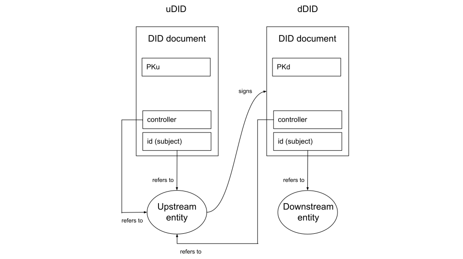
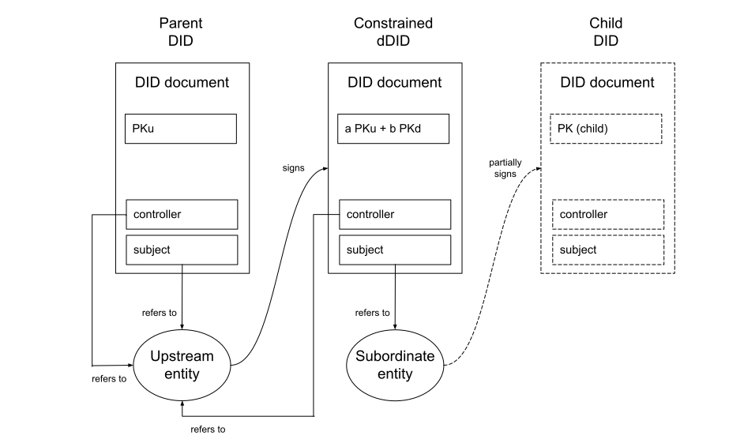

# Technical Notes

## Independently Verifiable Timestamping

Trustchain adopts the W3C standard for Verifiable Credentials (VCs) and specifies the precise nature of the Verifiable Data Registry which plays a central role in the [VC data model](https://www.w3.org/TR/vc-data-model-2.0/#roles). The main purpose of this data registry is to store [Decentralised Identifiers](https://www.w3.org/TR/did-core/) (DIDs) and associated DID Documents containing public key information.

The data registry employed by Trustchain enables independent verification of:
 1. the timestamps associated with DIDs and DID Documents (including metadata),
 2. the content of those DID Documents.

In other words, anybody who wishes to do so can verify that a particular Trustchain DID was published at a particular date/time, and that the content of the associated DID Document has not been modified since that time.

Several core operations in Trustchain depend on this ability to create (DIDs) with independently verifiable timestamps, as [explained in the FAQ](faq.md#q-why-is-independently-verifiable-timestamping-important-in-trustchain). Here we explain the verification mechanism.

Trustchain delegates the process of DID creation and timestamping to the [Identity Overlay Network](https://identity.foundation/ion/) (ION), open source software from the Decentralized Identity Foundation. The verifiable timestamping mechanism delivered by ION, and leveraged by Trustchain, ultimately depends on the continuous and cumulative proof of work performed by the Bitcoin network. It involves embedding IPFS content identifiers (cryptographic hash digests) into Bitcoin transactions, thereby furnishing the IPFS content (DID documents, in this case) with the same timestamp as the transaction itself.

Anybody can verify that a particular Bitcoin transaction is contained in a particular block by executing a series of SHA256 hash operations and comparing the result to the hash digest found inside the block header. By performing a similar process for each subsequent block, they can accurately estimate the amount of work done to produce the "strongest" (i.e. most computationally expensive) chain of blocks.

Since this work would need to be re-done by anyone attempting to modify the block containing the transaction of interest, the verifier can infer a realistic estimate of the computational cost of falsifying such a timestamp. And from this computational cost, the economic cost of such an attack can be estimated.

Very little computational effort is required to perform the verification, and the blockchain data structure contains all of the information needed to verify the timestamp, so no trust in any third party is required.

At the time of writing (April 2022), the total hash rate of the Bitcoin network is >600 EH/s and the [theoretical cost](https://www.crypto51.app/) (in USD) to modify the history of the chain, as a function of the temporal depth of the attack, is as follows:

| 0  | 1 hour | 1 day | 1 week | 1 month |
|----|--------|-------|--------|---------|
| ~$1 | $3.4m | $81.0m | $566.8m | $2.463b |

We can see that it is very cheap to create honest timestamps but very expensive to create deceptive ones. (In addition, any attempt at deception would be immediately observable by all nodes on the Bitcoin network.)

In this way, the timestamp on a transaction (and hence on a DID Document) can be verified in a quantitative manner by computing how expensive it would be to execute an attack to produce a deceptive timestamp.

## Downstream DIDs

A downstream DID (dDID) is a decentralised identifier in which the trustworthiness of the information contained in the corresponding DID document is attested to by an upstream entity, whose identity is itself represented by an upstream DID (uDID). The act of creating a dDID is an assertion, on the part of the upstream entity, of their confidence in the trustworthiness of the identifying information contained in the dDID document. In particular, it is an assertion that downstream entity is in sole possession of the private keys corresponding to the public keys found in the dDID document.

In a dDID the [DID subject](https://www.w3.org/TR/did-core/#did-subject) refers to the downstream entity and the [DID controller](https://www.w3.org/TR/did-core/#did-controller) is the upstream entity that signs the dDID document, thereby attesting to its trustworthiness. The `controller` property in the dDID must therefore contain a string matching that of the `id` property in the uDID.

The signature of controller is stored in the [DID Document Metadata](https://w3c-ccg.github.io/did-resolution/#output-documentmetadata).

This signature represents an assertion by the upstream entity and therefore the public key with which the signature can be verified must be that contained in the [`assertionMethod`](https://www.w3.org/TR/did-core/#assertion) property of the uDID. That is, for verification purposes, the dDID is treated in exactly the same way as a Verifiable Credential (VC) issued by the upstream entity; the proof contained in the dDID document metadata conceptually makes the dDID into a credential in which the subject is the downstream entity.

<!-- 

 -->

Here the public key PKu is value associated with the `assertionMethod` property in the uDID (i.e. it's the public key used to verify assertions made by the upstream entity). The signature is on the dDID is just such an assertion. It is stored in the dDID Document Metadata and verified using PKu.

Similarly, PKd is the value associated with the `assertionMethod` property in the dDID. It provides the verification method for further dDIDs and/or VCs issued by the downstream entity.

## Upstream DID Key Rotation

When keys are rotated in an upstream DID, attestations that depend on the expiring keys must be reinstated using the new keys if the same network structure is to be preserved.

These renewed attestations should be included in the same batch of DID operations as the uDID update operation itself, to avoid any interruption to the services provided by the Trustchain infrastructure.

Attestations made with keys that are common to both the original and updated uDID need not be renewed, as there will still exist a verifiable chain of attestations via the new path. In this case the dDID will be older than the uDID, but the attestation remains valid because the chronological order in which upstream and downstream DIDs are published is unimportant; what matters is that the signature on the dDID can be verified using a key in the uDID.

## Root DID Key Rotation

Root DID key rotation is more subtle than regular uDID key rotation (considered above) because here the chronological order of events does matter. An updated root DID will have a timestamp that differs from the generally accepted root event time and therefore, even if all downstream attestations are reinstated, every dDID verification attempt will fail.

The solution is to slightly relax the condition for a root DID to be considered valid. It will be valid if *either*:

- its timestamp matches the known root event time, *or*
- its chain of update (or recovery) operations can be traced back to a DID whose timestamp matches the root event time.

## Root DID Update and Recovery Secrets

If the root DID update secret is compromised then an attacker could insert their own keys and/or remove the legitimate keys in an updated root DID document. The only defence against such an attack would be to use the recovery secret to recover the root DID (with a new update secret).

If the root DID recovery secret is compromised then an attacker could acquire complete and irrevocable control over the contents of the root DID document. The only defence in that case would be for the genuine root entity to execute the recovery operation first, thereby introducing a new recovery secret. Otherwise the whole network must be abandoned.

However, both of these risks can be reduced dramatically by including multiple secrets in the pre-image of the update and recovery commitments and then dividing those secrets among multiple parties. Any update or recovery operation would then require the cooporation of several different parties and therefore the compromise of any one (or small number) of the secrets would not result in a vulnerability.

## Constrained dDIDs

This idea was inspired by our [analysis of the existing Web PKI](https://github.com/alan-turing-institute/trustchain/wiki/Trustchain%3A-Review-of-Web-PKI) and in particular the problem of "[surprising certificates](https://datatracker.ietf.org/doc/html/draft-iab-web-pki-problems-01.txt#section-3.3)".

In the Web PKI context, a mitigation strategy against surprising certificates is for root Certification Authorities (CAs) to impose name constraints on the certificates that can be issued by their subordinate CAs. For instance, the subordinate may only be allowed to issue a certificate under a particular top-level domain. The mechanism for enforcing these constraints is via guidelines that encourage browser vendors to check for violations.

Our aim, in the context of a decentralised PKI for digital identity, is to enforce constraints on the issuance of DIDs cryptographically, rather than merely encouraging software vendors to police them.

The aim is to enable an upstream entity to issue a downstream DID to another (subordinate) entity that delegates permission for them to extend the chain of trust further by issuing their own dDIDs, but also imposes constraints on the nature (i.e the contents) of those dDIDs.

The types of constraints imagined include:

- name constraints on service endpoint URIs (or other network addresses)
- constraints on allowed verification methods
- constraints on the existence (or otherwise) of particular DID data & metadata parameters
- constraints on the types of VCs that can be issued.

The proposed enforcement mechanism is via the [verification method](https://www.w3.org/TR/did-core/#verification-methods) (e.g. public key) specified in the `assertionMethod` property of the constrained dDID issued to the subordinate entity.

As explained [above](#downstream-dids), in the standard (unconstrained) case the `assertionMethod` property in the uDID is used to express the public key with which to verify the attestation signature on the dDID. Therefore, when permission to issue DIDs further downstream is delegated to a subordinate entity, it is the public key of the subordinate entity that belongs in the `assertionMethod` property.

In the constrained case, however, the `assertionMethod` instead contains a 2-of-2 multi-signature public key that represents both the subordinate and the upstream (delegating) entity. This means that any lower-level dDID issued by the subordinate must be signed by *both* the subordinate *and* the superior entity. The subordinate is prevented from issuing their own dDIDs without first obtaining the signature of their uDID superior.

The key difference, versus the unconstrained case, is that the `assertionMethod` property in the Constrained dDID is a linear combination of the public keys of the upstream and subordinate entities (PKu and PKd). This aggregated public key can be used to verify a multi-signature produced by *both* entities (assuming here a Schnorr multi-signature scheme such as [MuSig2](https://dl.acm.org/doi/abs/10.1007/978-3-030-84242-0_8); there are others of course).

When the subordinate entity wants to issue a dDID, it collects the information and constructs a candidate DID document but does not attempt to publish it (because, without the upsteam entity's signature, this new dDID is invalid). To get the upstream entity's signature, the subordinate makes a call the the upstream entity's Web API (using an endpoint specified in their own uDID), requesting their signature and passing the candidate DID document.

The call to the upsteam entity's Web API returns a conditional signature that is valid if and only if the exact same DID document is subsequently signed by the subordinate entity. The API call provides the upstream entity with the opportunity to check that the constraint is not violated. The business logic behind the API endpoint takes the candidate DID document, checks the constraint, hashes the document, signs the hash and returns the conditional signature. If the candidate DID violates the constraint, an error is returned by the API.

Assuming the constraints are respected, the subordinate entity now has a partially-signed hash of the candidate dDID document, and only needs to add its own signature to make it a valid dDID that can be published.

Notice that the upstream entity does not need to be directly involved in the construction of the final dDID, except by exposing the Web API, because the logic for checking the constraint can be encoded and a conditional signature provided automatically that will only be valid if the final version of the dDID exactly matches that which was sent to the API.

Also, the reference software client can include the API logic so the upstream entity need only specify the particular constraints they wish to impose on the subordinate at the time of creating their dDID, and the rest is automatic.

One might ask: what is the point of the subordinate dDID in this scenario? Since a signature from the upstream entity is required anyway, why bother with the multisignature involving both the upstream and subordinate entities? The point is that the attestion as to the correctness of the information in the final dDID is being made by the subordinate, not the upstream entity. It is the subordinate that is responsible for collecting and verifying the information contained, and this should not be confused with (or made equivalent to) the case where the upstream entity issues its own dDIDs. In particular, we want to be able to revoke the subordinate's dDID (thereby automatically revoking any of *their* downstream DIDs) without affecting the status of the upstream entity's DID.

While the above seems like it *might* work in practice, there are some **open research questions** associated with this idea, in particular:

- Is the Schnorr signature aggregation approach, assumed above, the best way to implement the multi-signatures required for this scheme, or are other cryptographic protocols (e.g. using conditional signatures) available that offer advantages?
- Is it possible to achieve a similar result without requiring an interactive signing protocol at all? That is, could cryptographic constraints be built into dDIDs at the point of creation, without requiring any further involvement from the upstream entity?

## Constrained VC Issuance

The mechanism outlined [above](#constrained-ddids) for imposing constraints on the nature of the dDIDs that can be created by a subordinate entity could also be used to restrict the nature of the Verifiable Credentials that they can issue.

To see this, observe that a dDID is itself a form of VC, and therefore constrained dDIDs are in fact a special case of constrained VC issuance.

As a concrete example, suppose the upstream entity is a central bank and the subordinate is a commercial bank. Now suppose that an insider at the commercial bank is prepared to issue fraudulent VCs (for a fee) that attest to an individual having Legal Disability Status, which would entitle the individual to certain benefits.

The commercial bank is a recognised by the central bank as a legitimate issuer of VCs pertaining to certain attributes, such as minimum age, employment status, creditworthiness etc., but can *not* legitimately attest to an individual's disability status.

Constrained VC issuance refers to the idea that the dDID created by the upstream entity (the central bank) constrains the attributes that can be attested to in VCs issued by the subordinate entity (the commercial bank). Any VC that violates these constraints is referred to as *transgressive*.

One way to impose this constraint would be to embed metadata in the dDID specifying which VC attributes can legitimately be attested to by the dDID subject. However, this would require the verifier's client software to faithfully check that metadata and reject a VC if it violated the given constraints, even if the signature on the VC and the trustchain of the dDID were valid. There is no way to guarantee that the client software would correctly perform this additional check.

The constrained VC approach is much more robust. In this case, the VC must be signed by both the upstream and subordinate entities, giving the upstream entity an opportunity to check that the attribute constraints have not been violated. This makes it *impossible* for the subordinate to issue a transgressive VC.

Because the check that the upstream entity performs, in order to verify that the candidate VC does not violate any of the desired constraints, is fully automated (requiring only a Web API call), this approach can scale to the case of VCs which are likely to be issued at a much higher frequency than dDIDs.

<!-- [TODO: check whether there is any mechanism in the DID or VC standards for achieving this end, i.e. for constraining the attributes that can be attested to by a DID subject.] -->

## Rebasing

Suppose two independent root transactions are created by two separate user communities. Each then builds a tree of trust relationships branching out from their respective roots, in the form of chains of downstream DIDs.

At some later date, there may be a mutual agreement that one community should assimilate the other, by enabling chains of trust from (part or all of) tree $B$ to be traced back to the root of tree $A$.

This can be achieved by simply creating a dDID on tree $A$ that duplicates an existing DID in tree $B$ (which may be the root of tree $B$, but need not be). All DIDs on tree $B$ that are downstream of the duplicated DID are automatically included in tree $A$, since there now exists a valid chain of trust to its root.

We refer to this operation as *rebasing*, because it is somewhat similar to the rebase operation found in the Git version control system.

The act of rebasing revokes (i.e. invalidates) the original DID on tree $B$, because (according to the DID standard) the latest valid DID overrides any earlier ones. Note that this does *not* invalidate the DIDs that are downstream of the rebased node on tree $B$, provided the same keys are included in the rebased DID.

Since those dDIDs in tree $B$ existed before the rebasing operation was performed, the timestamps on a rebased trustchain will not necessarily follow reverse chronological order (back to the root) as would be expected in a regular chain. In itself this is not problematic, because the authenticity of the chain is assured by the validity of the chain of signatures, not by the downstream timestamps. However further assurance could be provided by attaching metadata to the rebased DID indicating that any chain involving it may legitimately include non-chronological timestamps.

The option to rebase one root or branch onto another tree may be beneficial for adoption of the technology, as it enables different groups to begin using the system independently without leading to permanently parallel and disconnected systems.

This feature also promotes one of the key benefits of decentralisation, namely permissionless access, since marginalised communities can establish their own roots of trust and make use of the technology without accepting or contributing to the possibility of long-term exclusion.

## Interoperability dDIDs

The concept of an *Interoperability dDID* provides a means to support loosely-coupled federation across multiple, pre-existing digital ID systems in which Verifiable Credentials (VCs) are issued either by an identity provider itself, or by a recognised (subordinate) issuer.

For simplicity, we consider the case of two national ID systems, administered by entities we refer to as Local and Remote. In the Trustchain model both entities are represented by DIDs, which are themselves downstream from some root DID. The root may be common to both or distinct (in which case Local and Remote occupy disjoint trust networks).

Suppose Alice, a user who is registered in the Local system, has a credential issued by the Local ID provider, which she can use to prove certain individual attributes about herself. A verifier operating within the Local system will be able to verify the signature on Alice's credential by resolving the Local ID provider's DID document to retrieve their public key.

Now suppose Alice travels to the country where the Remote entity operates the national ID system, and she wishes to use the same credential. As things stand this will not be possible, because verifiers will only accept credentials signed by the Remote entity (i.e. their own national ID provider), or a recognised subordinate thereof.

Before the two systems can become interoperable some sort of "Trust Framework" must be established between the Local and Remote entities, including a formal agreement to recognise credentials issued by the foreign system. Such frameworks necessarily take into account a variety of considerations (legal, regulatory, political, etc.) which are outside the scope of any technical solution. However, there remains the technical question of how a formal policy agreement is brought into effect in a live digital ID system. This is where the interoperability dDID can play a role.

A trust agreement between the Local and Remote ID providers is embodied in a new downstream DID, jointly signed by both entities. This **interoperability dDID**  represents a new combined entity, and the corresponding DID document includes the public keys already associated with each of the individual providers (in their own DID documents) for the purpose of VC issuance.

As soon as the interoperability dDID is published, it is automatically downloaded and verified by users and verifiers in both systems.

Now, when Alice presents her credential to the Remote verifier she also shares a reference to the interoperability dDID. The verifier resolves the corresponding DID document to obtain the public keys of the Local entity, with which they can verify the authenticity of Alice's credential. The verifier also checks the chain of signatures on the interoperability dDID and finds a valid chain leading to the DID of the Remote ID provider, which is already recognised (and can be re-verified back to the trusted root if necessary).

Through this mechanism, credentials previously issued under either the Local or Remote system become instantly verifiable in the other system as soon as the interoperability dDID is published.

By selecting which keys to include in the interoperability dDID, the Local and Remote ID providers can be selective about which sets of credentials should be included within the terms of the trust agreement.

In this example we have considered federation across two pre-existing digital ID systems, but the same mechanism could be applied to enable interoperability between larger groups. Provided the interoperability dDID is signed by all participating entities, and contains the relevant keys from each, it scales to groups of any size.

In order to achieve a similar arrangement, without the means of an open & shared public key infrastructure, bilateral or multilateral agreements between identity providers would need to be securely communicated to all users and relying parties, including updating lists of trusted public keys on their client devices. In that scenario device updates would become an attack vector and, in the absence of a universally accessible & verifiable "ground truth", the shared state across different participants in the system could easily become unsynchronised.

<!-- [TODO: consider the (more complicated) case in which the VC is issued not by the ID provider itself but by a subordinate entity. ] -->

&nbsp;
